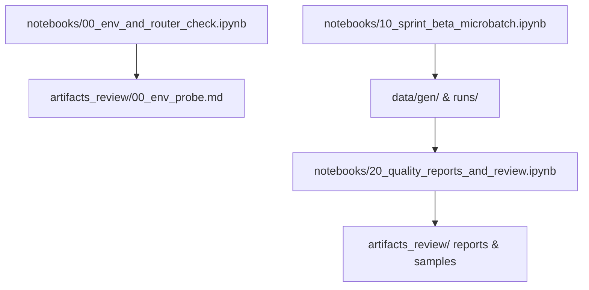

# Artifacts Review Directory

This directory contains review-safe artifacts generated by the notebook pipeline. All files in this directory are safe for version control and code review.

## Directory Structure

```
artifacts_review/
├── README.md                           # This file
├── 00_env_probe.md                     # Environment and router probe report
├── generation_summary.md               # Data generation summary
├── quality_review_report.md            # Detailed quality metrics
├── deduplication_report.md             # Deduplication analysis
├── cost_and_quota.md                   # API costs and quota usage
└── samples/                            # Sample files for manual review
    ├── alc_sample_1.json
    ├── alc_sample_2.json
    ├── ar_sample_1.json
    ├── ar_sample_2.json
    └── rsd_sample_1.json
```

## File Descriptions

### 📋 00_env_probe.md
- **Source**: `notebooks/00_env_and_router_check.ipynb`
- **Content**: Environment variables status, provider availability, router configuration
- **Safety**: Contains NO sensitive information (API keys masked as `[PRESENT_Xchars]`)
- **Purpose**: Verify system setup before running generation pipeline

### 📊 generation_summary.md
- **Source**: `notebooks/20_quality_reports_and_review.ipynb`
- **Content**: Overall statistics for generated samples by task type
- **Includes**: Sample counts, schema compliance rates, ASK trigger rates
- **Purpose**: High-level overview of generation results

### 🔍 quality_review_report.md
- **Source**: `notebooks/20_quality_reports_and_review.ipynb`
- **Content**: Detailed quality metrics and analysis
- **Includes**: Schema compliance details, ASK analysis, control symbol validation, politeness detection
- **Purpose**: Comprehensive quality assessment for each task type

### 🗂️ deduplication_report.md
- **Source**: `notebooks/20_quality_reports_and_review.ipynb`
- **Content**: Analysis of duplicate samples and deduplication effectiveness
- **Includes**: Duplication rates, similarity analysis
- **Purpose**: Verify data diversity and uniqueness

### 💰 cost_and_quota.md
- **Source**: `notebooks/20_quality_reports_and_review.ipynb`
- **Content**: API usage costs, quota consumption, Fail-Over statistics
- **Includes**: Provider usage breakdown, cost estimates, rate limit hits
- **Purpose**: Track resource usage and optimization opportunities

### 📄 samples/*.json
- **Source**: `notebooks/20_quality_reports_and_review.ipynb`
- **Content**: Representative sample files for manual inspection
- **Selection**: 1-2 samples per task type (ALC, AR, RSD)
- **Purpose**: Manual verification of data quality and format compliance

## Safety & Review Guidelines

### ✅ Safe for Version Control
- All files in this directory are explicitly allowed in `.gitignore` with `!artifacts_review/**`
- No sensitive information (API keys, secrets) is included
- Files contain only review-relevant data and metrics

### 🔒 Privacy & Security
- API keys are never stored or displayed in these files
- Sample data is anonymized and contains no personal information
- All outputs are generated from synthetic or processed data

### 📝 Review Process
1. **Automated Checks**: Review `00_env_probe.md` for system readiness
2. **Quality Assessment**: Examine metrics in `quality_review_report.md`
3. **Sample Verification**: Manually inspect 2-3 samples from `samples/`
4. **Cost Analysis**: Review resource usage in `cost_and_quota.md`
5. **Decision**: Approve for larger batch generation or request fixes

## Generation Workflow



## File Lifecycle

1. **Generation**: Files created by notebook execution
2. **Review**: Files examined for quality and compliance
3. **Approval**: Green light for larger batch generation
4. **Archival**: Files committed to version control for audit trail

---

*This directory serves as the interface between automated generation and human review, ensuring all generated artifacts are safe for version control and stakeholder review.*
