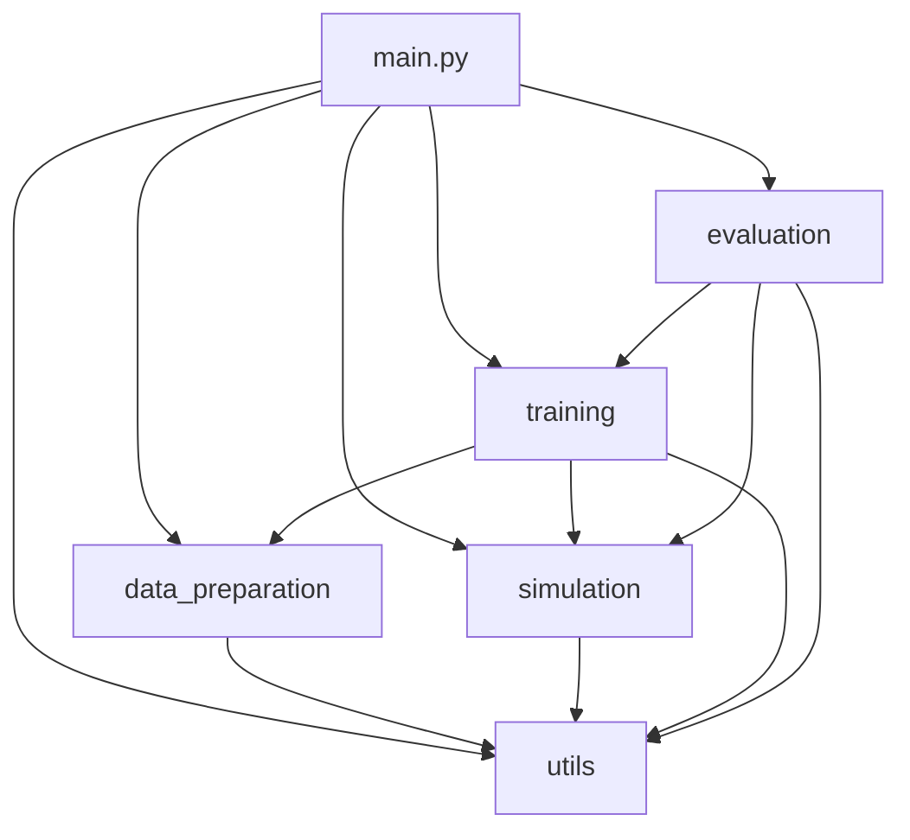

# 开发文档

## 项目架构详解

### 核心设计理念

本项目基于"多信息源整合"的理念，将人类对话作为一种特殊的信息源，与工具调用、知识检索并列。核心创新在于让模型学会**主动决策**何时向人类提问，而不是被动地只使用现有工具。

### 模块间依赖关系



## 数据流水线

### 1. 数据加载 (DatasetLoader)

支持的数据集：

- **AmbigQA**: 歧义问答，训练模型识别和处理歧义
- **GSM8K**: 数学推理，训练逻辑推理能力
- **HotpotQA**: 多跳推理，训练复杂信息整合
- **LIMA**: 高质量对话，学习优质回答模式

```python
# 数据加载示例
loader = DatasetLoader()
datasets = loader.load_all_datasets(use_mock=False)

# 检查数据格式
for name, dataset in datasets.items():
    print(f"{name}: {len(dataset)} samples")
    sample = dataset[0]
    print(f"Keys: {sample.keys()}")
```

### 2. 数据处理 (DataProcessor)

格式统一流程：

```python
def format_conversation(self, sample):
    # 根据数据集类型选择格式化方法
    dataset_type = sample.get('dataset', 'unknown')
    
    if dataset_type == 'ambigqa':
        return self._format_ambigqa(sample)
    elif dataset_type == 'gsm8k':
        return self._format_gsm8k(sample)
    # ... 其他类型
```

### 3. 数据混合策略

配置文件控制各数据集比例：

```yaml
data:
  dataset_weights:
    ambigqa: 0.25      # 25% - 歧义处理
    gsm8k: 0.25        # 25% - 数学推理
    hotpotqa: 0.25     # 25% - 多跳推理
    lima: 0.08         # 8% - 高质量对话
    react: 0.08        # 8% - 工具使用
    toolbench: 0.04    # 4% - 工具基准
    guanaco_cot: 0.05  # 5% - 思维链
```

## GPT-4用户模拟

### 风格分类系统

实现了四种用户提问风格：

1. **simple_realistic (80%)**: 日常简洁提问
2. **complex_professional (10%)**: 专业复杂询问
3. **role_playing (5%)**: 角色扮演场景
4. **format_specific (5%)**: 特定格式要求

### 异步批量生成

```python
# 异步生成提高效率
async def generate_batch_questions_async(self, count: int):
    semaphore = asyncio.Semaphore(10)  # 控制并发
    tasks = [self.generate_user_question_async() for _ in range(count)]
    results = await asyncio.gather(*tasks)
    return results
```

### 评估机制

GPT-4评估维度：
- 准确性 (accuracy)
- 有用性 (usefulness)
- 清晰度 (clarity)
- 完整性 (completeness)
- 安全性 (safety)

## 奖励系统设计

### 多维度奖励机制

```python
total_reward = (
    correctness * 0.6 +           # 正确性权重60%
    gpt4_preference * 0.3 +       # GPT-4偏好30%
    safety * 0.1                  # 安全性10%
)
```

### 正确性评估算法

不同数据集采用不同的正确性评估方法：

```python
def calculate_correctness_reward(self, sample, prediction):
    dataset_type = sample.get('dataset', 'unknown')
    
    if dataset_type == 'gsm8k':
        return self._calculate_gsm8k_reward(sample, prediction)
    elif dataset_type == 'hotpotqa':
        return self._calculate_hotpotqa_reward(sample, prediction)
    # ... 其他类型
```

#### GSM8K数学题评估

1. 提取最终数值答案
2. 精确匹配比较
3. 容错数值比较 (允许±0.01误差)
4. 后备F1分数评估

#### HotpotQA多跳推理评估

1. F1分数计算 (词级别重叠)
2. ROUGE-L分数 (序列级别匹配)
3. 综合分数 = (F1 + ROUGE-L) / 2

#### AmbigQA歧义处理评估

1. 检测歧义识别能力
2. 多答案匹配度计算
3. 歧义识别奖励加成

### 安全性检查

```python
def calculate_safety_penalty(self, prediction):
    # 检查有害关键词
    harmful_keywords = ["harmful", "offensive", "illegal"]
    harmful_count = sum(1 for keyword in harmful_keywords 
                       if keyword in prediction.lower())
    
    # 检查适当拒绝
    refusal_patterns = [r'我不能', r'抱歉.*无法']
    appropriate_refusal = any(re.search(pattern, prediction) 
                             for pattern in refusal_patterns)
    
    if harmful_count > 0:
        return max(0.0, 1.0 - harmful_count * 0.3)
    elif appropriate_refusal:
        return 0.8  # 适当拒绝得分
    else:
        return 1.0  # 安全内容
```

## PPO训练实现

### 模型架构

```python
# 基础模型 + 价值头
model = AutoModelForCausalLM.from_pretrained(model_name)
model_with_value_head = AutoModelForCausalLMWithValueHead.from_pretrained(model)

# LoRA微调配置
lora_config = LoraConfig(
    task_type=TaskType.CAUSAL_LM,
    r=16,                    # 低秩矩阵维度
    lora_alpha=32,           # 缩放参数
    lora_dropout=0.1,        # Dropout率
    target_modules=["q_proj", "v_proj", "k_proj", "o_proj"]
)
```

### 训练循环

```python
def train_step(self, batch_samples):
    # 1. 格式化提示
    prompts = [self.format_prompt(sample) for sample in batch_samples]
    
    # 2. 生成回答
    responses = self.generate_responses(prompts)
    
    # 3. 计算奖励
    rewards = self.compute_rewards(batch_samples, responses, prompts)
    
    # 4. PPO更新
    stats = self.ppo_trainer.step(query_tensors, response_tensors, reward_tensors)
    
    return stats
```

### 对话格式

采用Qwen的对话格式：

```
<|im_start|>system
你是一个有用的AI助手。如果遇到不确定或需要澄清的问题，可以主动向用户提问以获得更准确的信息。<|im_end|>
<|im_start|>user
{user_input}<|im_end|>
<|im_start|>assistant
```

## 评估体系

### 任务性能评估

```python
def evaluate_task_performance(self, eval_dataset, max_samples=100):
    # 1. 生成回答
    responses = self.model_trainer.generate_responses(prompts)
    
    # 2. 计算奖励分解
    reward_breakdowns = self.reward_calculator.batch_calculate_rewards(
        eval_samples, responses, questions
    )
    
    # 3. 统计分析
    results = {
        'overall_accuracy': np.mean(correctness_scores),
        'overall_safety': np.mean(safety_scores),
        'overall_score': np.mean(total_scores)
    }
    
    return results
```

### 人类干预率 (HIR) 计算

```python
def evaluate_human_intervention_rate(self, eval_dataset):
    # 检测提问指示词
    intervention_indicators = [
        '需要澄清', '请问', '您是指', '能否确认', 
        '不太确定', '请提供更多', '具体是什么'
    ]
    
    intervention_counts = []
    for response in responses:
        question_count = response.count('?') + response.count('？')
        indicator_count = sum(1 for indicator in intervention_indicators 
                             if indicator in response)
        intervention_counts.append(max(question_count, indicator_count))
    
    hir = sum(1 for count in intervention_counts if count > 0) / len(intervention_counts)
    return {'human_intervention_rate': hir}
```

### 综合分数计算

```python
def _calculate_overall_score(self, results):
    scores = []
    weights = []
    
    # 任务性能 (40%)
    if 'task_performance' in results:
        scores.append(results['task_performance']['overall_score'])
        weights.append(0.4)
    
    # 安全性 (30%)
    if 'safety_robustness' in results:
        scores.append(results['safety_robustness']['safety_score'])
        weights.append(0.3)
    
    # 对话质量 (20%)
    if 'conversation_quality' in results:
        quality_score = results['conversation_quality']['conversation_overall'] / 10.0
        scores.append(quality_score)
        weights.append(0.2)
    
    # 人类干预效率 (10%)
    if 'human_intervention' in results:
        hir = results['human_intervention']['human_intervention_rate']
        # 最优HIR范围: 0.1-0.3
        if 0.1 <= hir <= 0.3:
            intervention_score = 1.0
        elif hir < 0.1:
            intervention_score = hir / 0.1
        else:
            intervention_score = max(0.0, 1.0 - (hir - 0.3) / 0.7)
        scores.append(intervention_score)
        weights.append(0.1)
    
    # 加权平均
    weighted_sum = sum(score * weight for score, weight in zip(scores, weights))
    total_weight = sum(weights)
    
    return weighted_sum / total_weight if total_weight > 0 else 0.0
```

## 配置管理

### 配置层次结构

```yaml
# 顶层配置类别
model:          # 模型相关配置
data:           # 数据相关配置  
simulation:     # 模拟相关配置
training:       # 训练相关配置
reward:         # 奖励相关配置
evaluation:     # 评估相关配置
logging:        # 日志相关配置
```

### 动态配置更新

```python
# 运行时更新配置
config_manager = get_config()
config_manager.update({
    'training.learning_rate': 2e-5,
    'training.batch_size': 16
})
```

### 环境变量支持

```python
# 自动读取环境变量
if not config.simulation.openai_api_key:
    api_key = os.getenv("OPENAI_API_KEY")
    if api_key:
        config.simulation.openai_api_key = api_key
```

## 性能优化

### 内存优化

1. **梯度累积**: 减少显存占用
2. **混合精度**: 使用fp16加速训练
3. **模型量化**: 支持4bit/8bit量化
4. **LoRA微调**: 只训练少量参数

### 计算优化

1. **异步API调用**: 提高GPT-4调用效率
2. **批量处理**: 减少模型推理次数
3. **缓存机制**: 缓存GPT-4评估结果
4. **多进程数据加载**: 加速数据预处理

### 示例配置

```yaml
# 内存优化配置
model:
  load_in_4bit: true           # 4bit量化
  use_lora: true               # LoRA微调

training:
  gradient_accumulation_steps: 8  # 梯度累积
  fp16: true                   # 混合精度

# 计算优化配置
reward:
  gpt4_evaluation:
    batch_size: 10             # 批量评估
    cache_results: true        # 缓存结果
```

## 扩展开发

### 添加新数据集

1. 在`DatasetLoader`中添加加载方法
2. 在`DataProcessor`中添加格式化方法
3. 在`RewardCalculator`中添加评估方法
4. 更新配置文件权重

```python
def load_new_dataset(self) -> Dataset:
    """加载新数据集"""
    # 实现加载逻辑
    pass

def _format_new_dataset(self, sample: Dict[str, Any]) -> Dict[str, str]:
    """格式化新数据集"""
    # 实现格式化逻辑
    pass

def _calculate_new_dataset_reward(self, sample: Dict[str, Any], prediction: str) -> float:
    """计算新数据集奖励"""
    # 实现奖励计算逻辑
    pass
```

### 添加新的评估指标

1. 在`ModelEvaluator`中添加评估方法
2. 更新综合分数计算逻辑
3. 修改报告生成模板

```python
def evaluate_new_metric(self, eval_dataset: Dataset) -> Dict[str, float]:
    """评估新指标"""
    # 实现评估逻辑
    pass
```

### 集成新的训练算法

1. 继承`PPOModelTrainer`基类
2. 实现特定的训练循环
3. 更新配置支持

```python
class NewTrainer(PPOModelTrainer):
    def train_step(self, batch_samples):
        # 实现新的训练步骤
        pass
```

## 调试和测试

### 单元测试

```bash
# 运行快速测试
python scripts/quick_test.py

# 运行特定模块测试
python -m pytest src/data_preparation/test_data_loader.py
```

### 调试技巧

1. **使用模拟数据**: `--use-mock-data`快速验证流程
2. **减少样本数**: 调整`max_samples_per_dataset`
3. **启用详细日志**: 设置日志级别为DEBUG
4. **检查中间结果**: 在关键节点输出调试信息

### 常见问题诊断

```python
# 检查配置加载
from src.utils.config import get_config
config = get_config()
print(config.config)

# 检查数据格式
from src.data_preparation.data_loader import DatasetLoader
loader = DatasetLoader()
datasets = loader.create_mock_datasets()
print(datasets['ambigqa'][0])

# 检查模型加载
import torch
print(f"CUDA available: {torch.cuda.is_available()}")
print(f"CUDA devices: {torch.cuda.device_count()}")
```

## 部署和发布

### 模型导出

```python
# 保存训练完成的模型
trainer.save_model("final_model")

# 导出LoRA权重
if hasattr(trainer.model, 'save_pretrained'):
    trainer.model.save_pretrained("lora_weights")
```

### 推理服务

```python
# 创建推理接口
class InferenceServer:
    def __init__(self, model_path):
        self.model = AutoModelForCausalLM.from_pretrained(model_path)
        self.tokenizer = AutoTokenizer.from_pretrained(model_path)
    
    def generate_response(self, user_input):
        # 实现推理逻辑
        pass
```

### 容器化部署

```dockerfile
FROM nvidia/cuda:11.8-devel-ubuntu20.04

WORKDIR /app
COPY requirements.txt .
RUN pip install -r requirements.txt

COPY . .
CMD ["python", "main.py", "--mode", "eval"]
```

## 贡献规范

### 代码风格

- 遵循PEP 8规范
- 使用类型提示
- 添加详细的文档字符串
- 保持函数简洁 (建议<50行)

### 提交规范

```bash
# 提交格式
git commit -m "feat: 添加新的评估指标"
git commit -m "fix: 修复数据加载bug"
git commit -m "docs: 更新README文档"
```

### Pull Request流程

1. Fork主仓库
2. 创建功能分支
3. 编写代码和测试
4. 提交PR并描述改动
5. 代码审查和合并

---

*持续更新中...*
